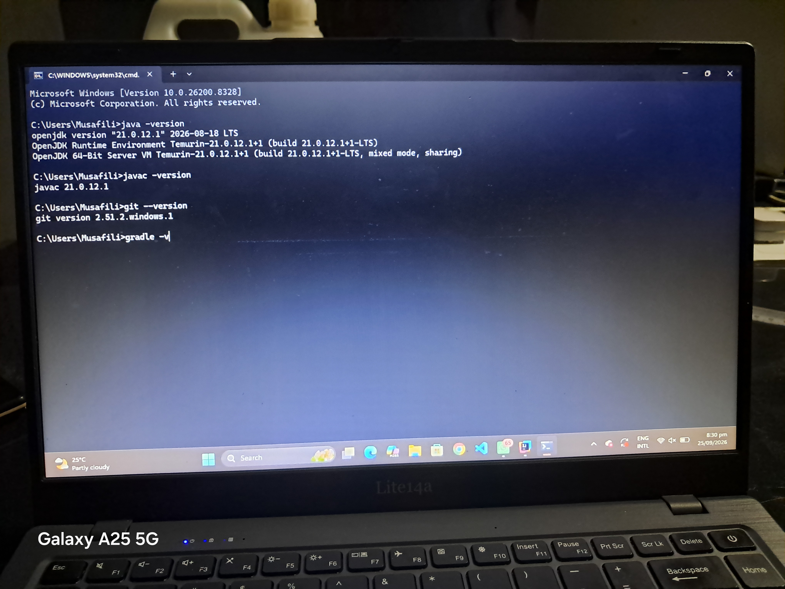
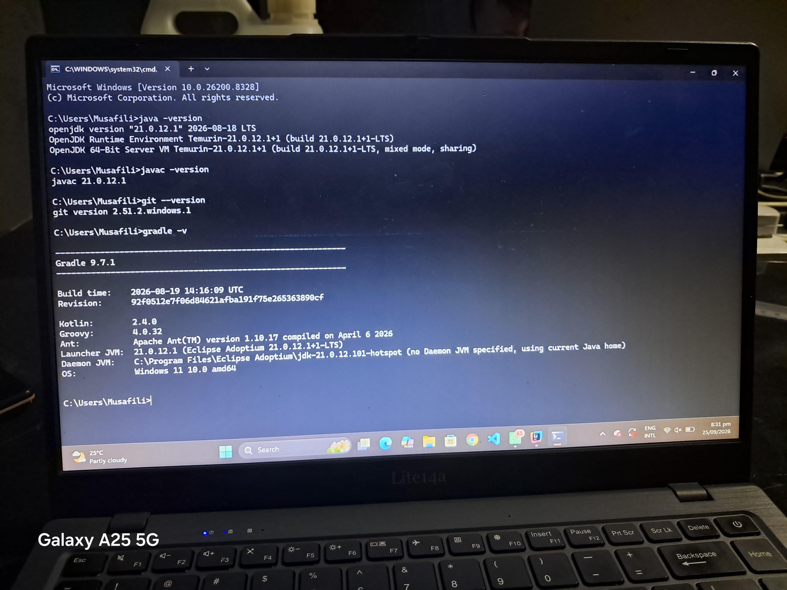
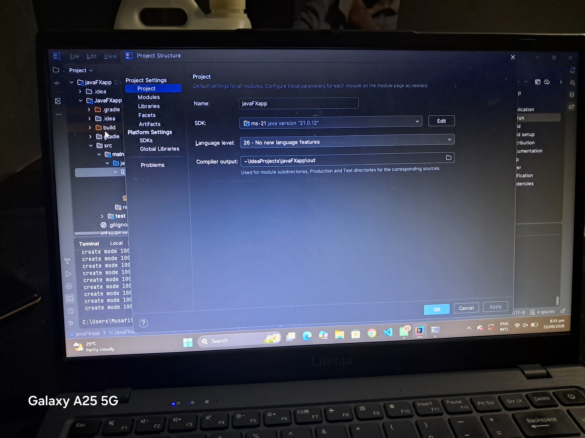
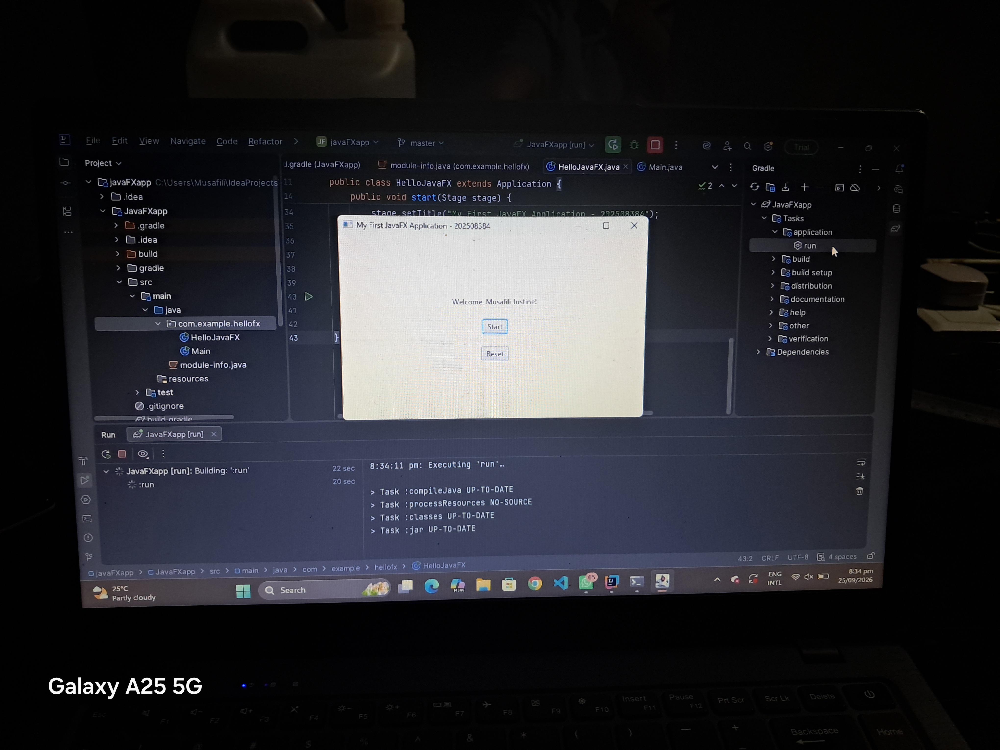
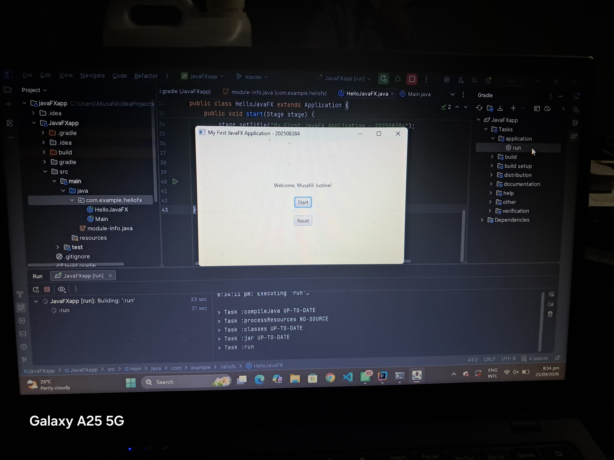
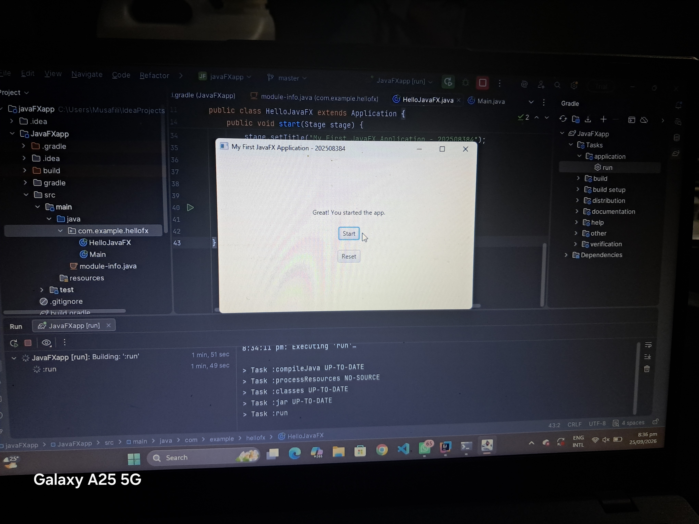

# JavaFX Lab 1 Submission

**Student Name:** Musafili Justine
**Student Number:** 202508384

## How to view my work
- The JavaFX code is located in: `JavaFXapp/src/main/java/com/example/hellofx`
- The `HelloJavaFX.java` file contains the application.
- The `Main.java` file is used to launch the application.

## How to find the required screenshots
The screenshots for the lab submission are inside the `JavaFXapp/Screenshot` folder.
Here they are for quick viewing:

1. **Java and Javac versions:**
   

2. **Git version:**
   

3. **Gradle version:**
   

4. **IntelliJ SDK JDK 21:**
   

5. **App before clicking:**
   

6. **App after clicking:**
   

## How to run the application
Open the terminal in IntelliJ and run:
`gradle run`